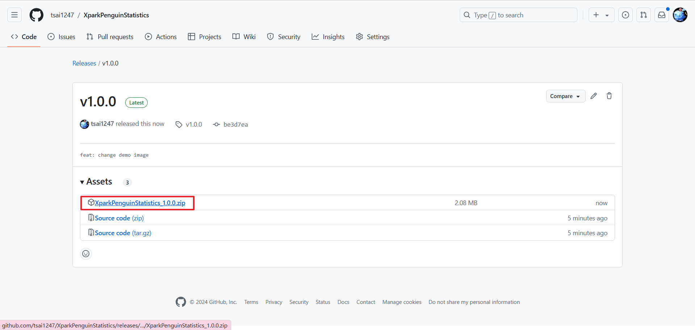

# XparkPenguinStatistics

- 簡單統計 Xpark 企鵝命名活動的有效留言數

## 用途

- 簡單統計現在有幾票

## 步驟

1. 安裝這個 Extension(目前應用程式商店審核中，成功前只能自己封裝了)
   1. 進入 Github 網址 https://github.com/tsai1247/XparkPenguinStatistics/releases/tag/v1.0.1
   2. 下載整包檔案  並解壓縮
   3. 到 chrome://extensions
   4. 右上角開啟開發人員模式。
   5. 選擇載入未封裝項目，點進剛才解壓縮的資料夾後按下確定
      1. 
   6. 安裝成功
2. 找到目標留言串，向下滑到底

- 自己往下滑留言到底，或是等我或其他高手有空加，因為我懶得查怎麼做
- 我只是叫 Claude 幫我快速寫一個而已

3. 按下搜尋看結果
   
